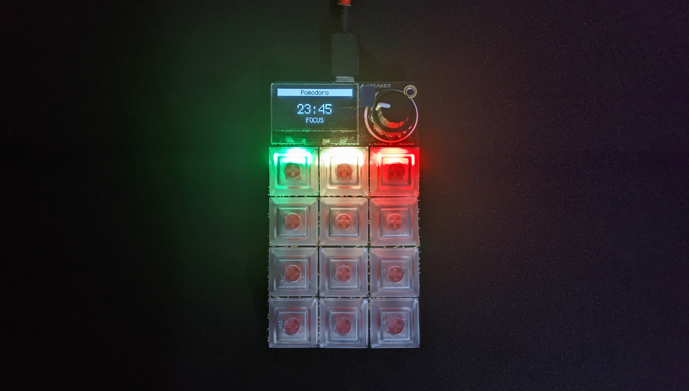
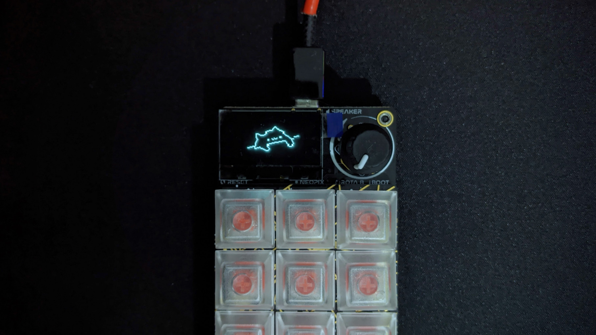

# Macropad Hotkeys With Extension Support

This is a modified version of the OG [Hotkeys](https://learn.adafruit.com/macropad-hotkeys) script from Adafruit. This script allows you to define custom functions to override the main loop to create your own functionalities. Currently, this repo includes a Pomodoro timer and a Bongo Cat thingy as extentions.

## Included Extensions

### Pomodoro Timer ([?](https://todoist.com/productivity-methods/pomodoro-technique))

`/macros/pomodoro.py`

#### Buttons

- **Green** - Start a pomodoro session
- **Yellow** - Pause/resume a session
- **Red** - Skip the current session

#### Configuring Pomodoro Sessions

You can customize the sessions duration, short break duration, long break duration and the sequence in which they occur by changing the constant variables defined in `/macros/pomodoro.py`

#### Notes

- "Slacking time" displayed after a session is calculated by `(time since first open) - (focused time)`
- Code is a bit messy as of now

### Bongo Cat

`/macros/bongo.py`

Bongo cat that taps when you tap. Based off of [this repo](https://github.com/christanaka/circuitpython-bongo). [Dependencies](https://github.com/christanaka/circuitpython-bongo#quick-start) required by bongo cat are included in the `/lib` directory.

## Creating your own extensions

You can use the template given in `/macros/sample.py` to create your own extensions.

## Roadmap

- [x] Base structure
- [x] Pomodoro Timer
- [x] Bongo Cat
- [x] Track focused time
- [x] Track slacking time
- [ ] Refactor/clean up Pomodoro timer 🧹
